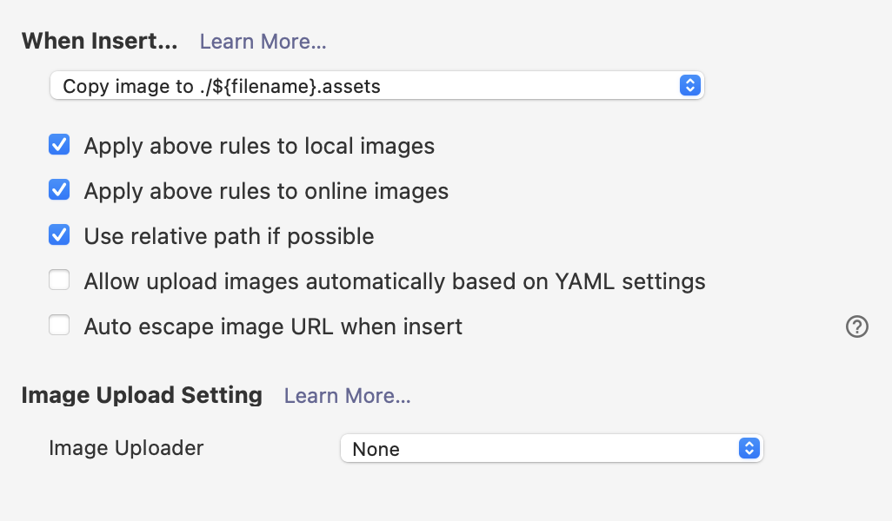

## OSX Setup
* Update OS

### Update Preferences
```shell
sh ./osx.sh
```

* Remap escape key

### Hostname

```shell
HOSTNAME=mynewname
sudo scutil --set HostName $HOSTNAME
sudo scutil --set LocalHostName $HOSTNAME
sudo scutil --set ComputerName $HOSTNAME
dscacheutil -flushcache
```

### Xcode

```shell
# Install xcode cli Tools
xcode-select --install
defaults write com.apple.Finder AppleShowAllFiles true
killall Finder
```

## Other tools

* Chrome Canary
* iStat Menus
* [Rectangle](https://rectangleapp.com/)


### iTerm2

Preferences ➔ Profiles ➔ Keys ➔ left option as Esc+, and then Profiles ➔ Keys ➔ Mappings to add option+left as Esc+b, and option+right as Esc+f

See https://stackoverflow.com/a/60079965


### Typora

* General -> On Launch -> Restore last closed
* Appearance -> Themes -> Use separate theme
* Image




### Fonts
[JetBrains Mono](https://www.jetbrains.com/lp/mono/)

### VS Code

* Open the Command Palette (Cmd+Shift+P) and type 'shell command' to find the Shell Command: Install 'code' command in PATH command.


## Setup

### Git Prereqs

```shell
ssh-keygen -t ed25519 -C "seth.rylan@gmail.com"

cat >  ~/.ssh/config <<EOF

Host *.github.com
  AddKeysToAgent yes
  IdentityFile ~/.ssh/id_ed25519
EOF

ssh-add --apple-use-keychain ~/.ssh/id_ed25519
```


## Install

### Clone

```shell
cd ~

git clone git@github.com:sethrylan/dotfiles.git ~/.dotfiles
```

### Set up dotfiles links

```shell
ln -s ~/.dotfiles/vscode/settings.json ~/Library/Application\ Support/Code/User/settings.json

ln -s ~/.dotfiles/gitconfig ~/.gitconfig

cat > ~/.zshenv <<EOF
source ~/.dotfiles/zsh/env.zsh
EOF

cat > ~/.zshrc <<EOF
source ~/.dotfiles/zsh/zshrc.zsh
EOF
```

### Install
```shell
/bin/bash -c "$(curl -fsSL https://raw.githubusercontent.com/Homebrew/install/master/install.sh)"
curl -o- https://raw.githubusercontent.com/nvm-sh/nvm/v0.39.1/install.sh | bash
sh -c "$(curl -fsSL https://raw.github.com/ohmyzsh/ohmyzsh/master/tools/install.sh)"
brew bundle --file ~/.dotfiles/Brewfile
```


### Setup Ruby with rbenv

```shell
rbenv versions
..
curl -fsSL https://github.com/rbenv/rbenv-installer/raw/main/bin/rbenv-doctor | bash
...
rbenv install 2.7.5
rbenv install 3.1.0
rbenv global 2.7.5
```

### Setup Java with jenv

```shell
jenv versions
...

...
jenv add /Library/Java/JavaVirtualMachines/jdk-11.0.12.jdk/Contents/Home
...
jenv global 11.0
```


### Sublime
* Install package control

```shell
ln -s ~/.dotfiles/sublime/User ~/Library/Application\ Support/Sublime\ Text/Packages/
```

## VS Code extensions

From https://wiki.nikitavoloboev.xyz/text-editors/vs-code/vs-code-extensions


